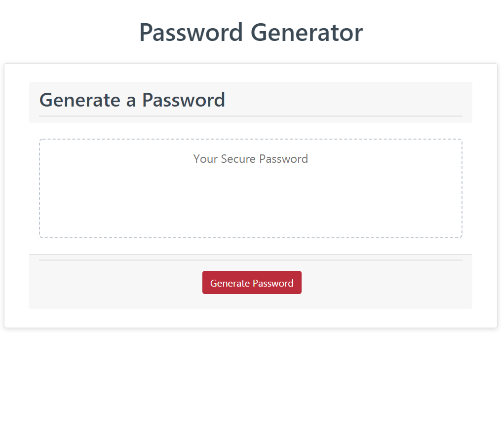
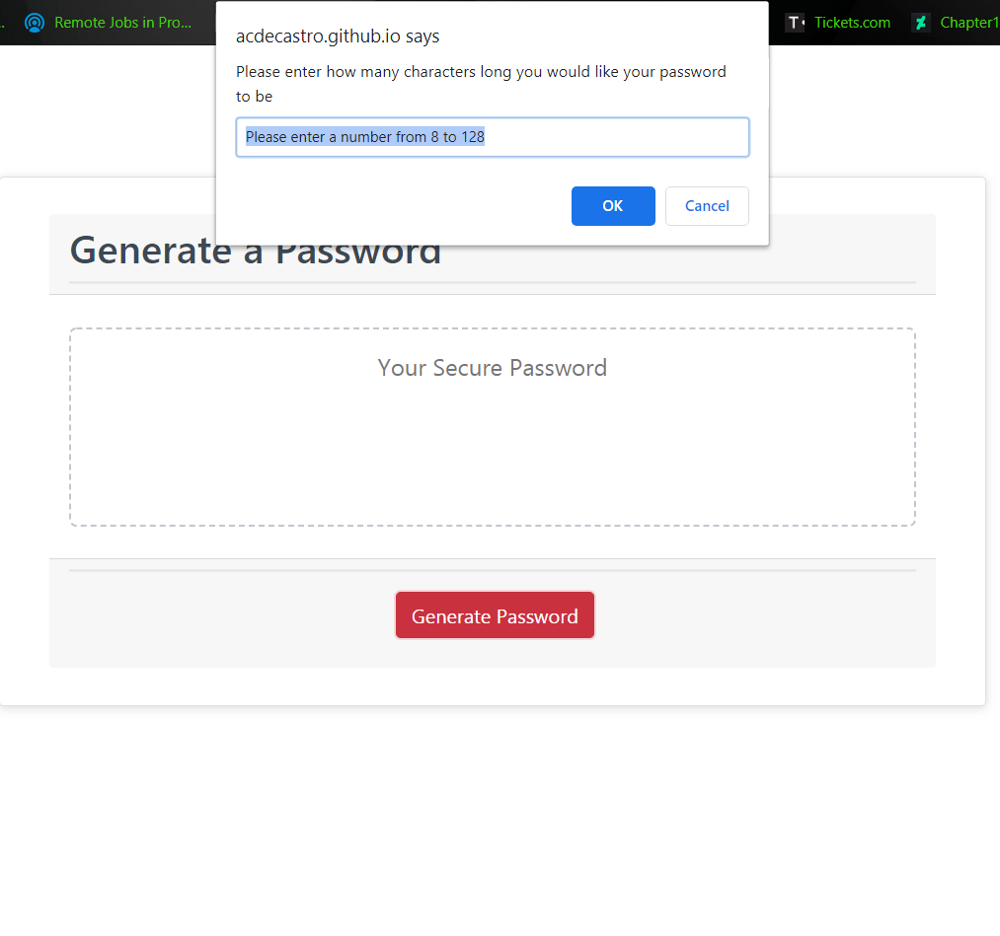
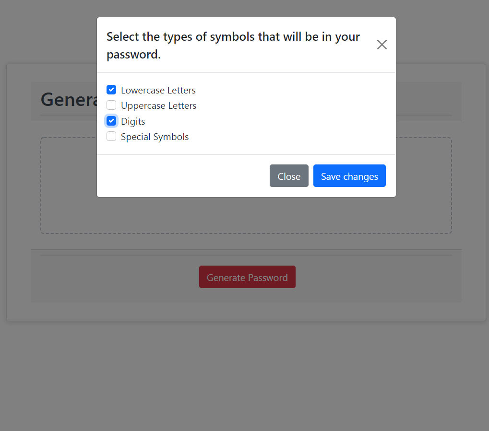
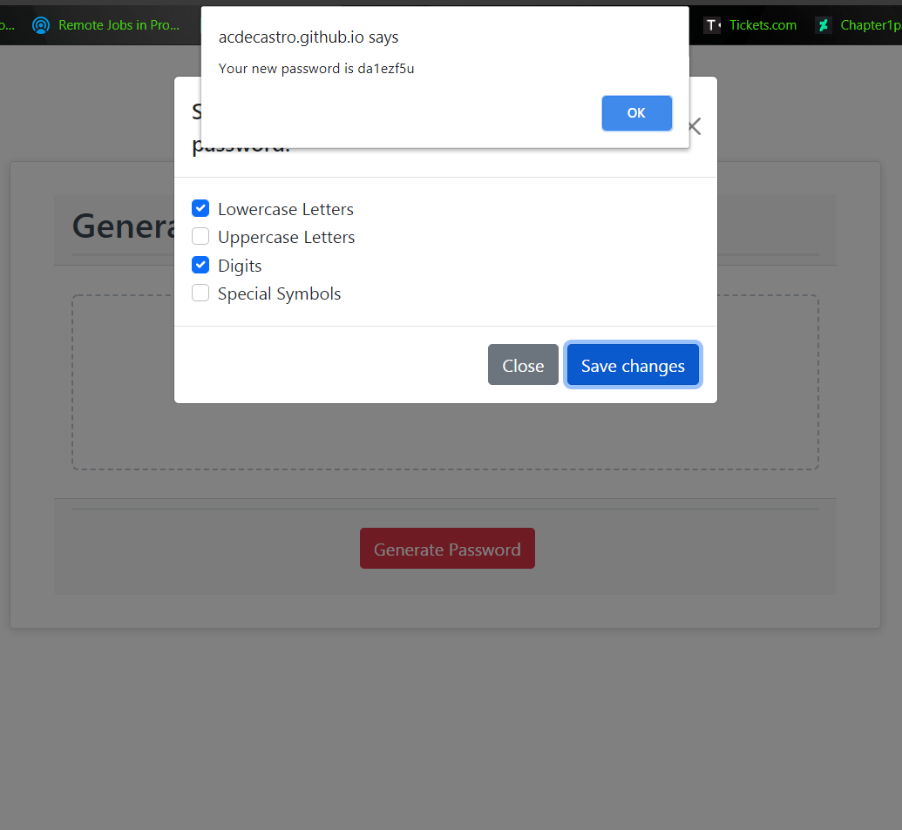
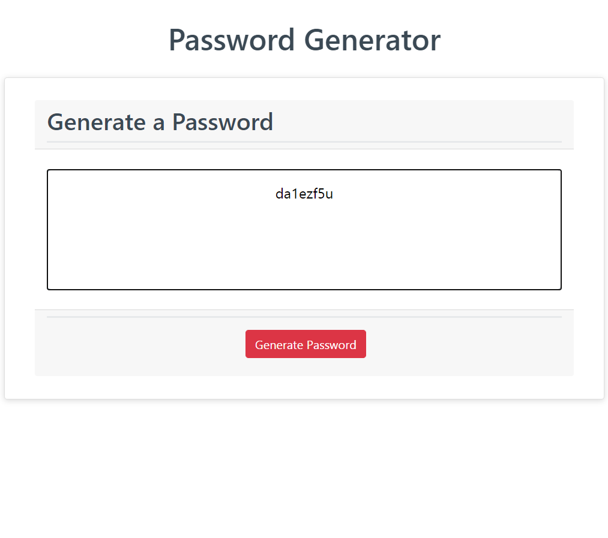

# Password Generator
Bootcamp Week 3 Homework

This application randomly generates a password based on criteria given by the user.

## Installation
Simply go to https://acdecastro.github.io/Password-Generator/ .

The code for this project can be viewed at https://github.com/ACDecastro/Password-Generator/ .

## Technologies Used
- Javascript
- HTML
- Bootstrap
- JQuery

## Usage
After opening the webpage, click on the "Generate Password" button.

A prompt will appear requesting an input of a number from 8 to 128. Type a number in the field provided and click "OK".

A modal will appear displaying a selection of checkboxes. Click on at least one of the checkboxes to select the types of characters you would like in your password.

Click "Save Changes" to generate a password using the criteria you provided. The password will be displayed in an alert. If you are not satisfied with that password for any reason, (such as missing symbol types) you can click "Save Changes" again, or close the modal to start the process again.

You password will also be displayed in the text field to make it easier to select and copy.

## Contributors
Antonio Decastro

# Contact
Contact me on LinkedIn or Github
- https://www.linkedin.com/in/antonio-decastro-58090915a/
- https://github.com/ACDecastro/